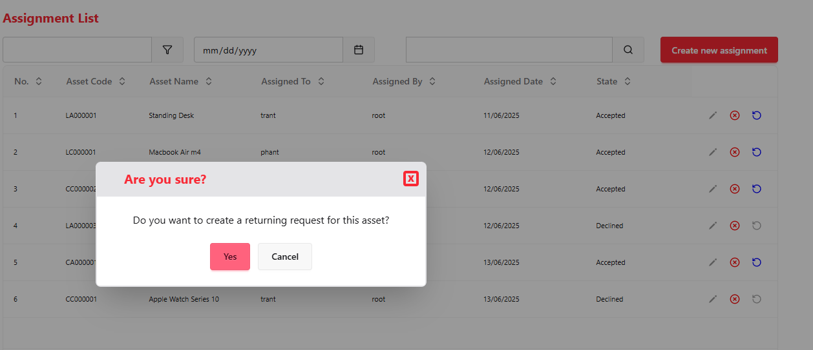

# Rookie2Engineer Batch 8 - Asset Management System

This project was developed as part of my internship at **NashTech** during **Mar - Jun, 2025**.  
The goal was to **create a mock webapp for managing company-owned assets and their assignment to employees inside  an internal system**.

---

## Table of Contents

- [Features](#features)
- [Tech Stack](#tech-stack)
- [Project Structure](#project-structure)
- [Getting Started](#getting-started)
  - [Backend Setup](#backend-setup)
  - [Frontend Setup](#frontend-setup)
- [Testing](#testing)
- [Contributing](#contributing)
- [License](#license)

---

## Features

- **User Management**
  - User registration, authentication (JWT), and role-based access control
  - Manage user profiles and permissions
- **Asset Management**
  - CRUD operations for assets
  - Asset status tracking (available, assigned, under maintenance, etc.)
  - Category management for assets
- **Assignment Management**
  - Assign assets to users
  - Track assignment history and status
- **Returning Request**
  - Request and approve asset returns
  - Manage return workflow and update asset status
- **Category Report**
  - Generate reports by asset category
  - Export reports to XLSX format
- **Backend**
  - FastAPI RESTful API
  - JWT-based authentication and authorization
  - XLSX exporter with openpyxl
  - PostgreSQL database with SQLModel ORM
  - Modular middleware (CORS, logging, authentication)
- **Frontend**
  - React 19 + TypeScript
  - TanStack Query for data fetching/caching
  - React Router for navigation
  - Zustand for state management
  - React-Hook-Form for form management
  - TailwindCSS & DaisyUI for styling
- **Testing**
  - Pytest for backend unit/integration tests

---

## Tech Stack

- **Backend:** FastAPI, SQLModel, PostgreSQL, PyXML, JWT
- **Frontend:** React, TypeScript, TanStack Query, React Router, Zustand, TailwindCSS, DaisyUI
- **Testing:** Pytest (backend)

---

## Getting Started

### Backend Setup

1. **Install dependencies:**

```sh
cd Rookie2EngineerBatch8-BE
python -m venv venv
source venv/bin/activate  # or venv\Scripts\activate on Windows
pip install -r requirements.txt
```

2. **Configure environment:**

Copy .env.example to .env and update values as needed.

3. **Run the backend:**

```sh
uvicorn main:app --reload
```

### Frontend Setup

1. **Install dependencies:**

```sh
cd Rookie2EngineerBatch8-FE
npm install
```

2. **Run the frontend:**

```sh
npm run dev
```

## Testing

### Backend(Pytest)

```sh
cd Rookie2EngineerBatch8-BE
pytest
```

## Preview

Here are some screenshots of the application features:

| Login Page                | User Management           | Change Password           |
|---------------------------|--------------------------|---------------------------|
|  |  |  |

| Category Report           | Confirmation Popup 1      | Confirmation Popup 2      |
|--------------------------|--------------------------|---------------------------|
|  |  | 
